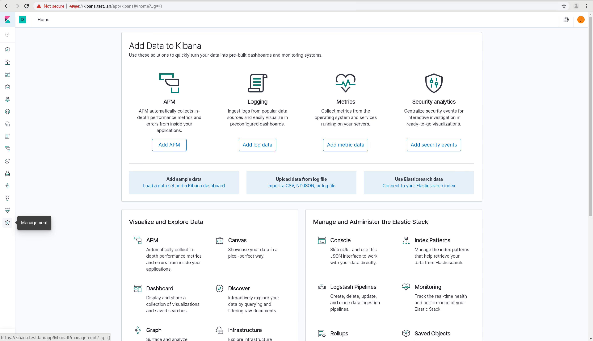
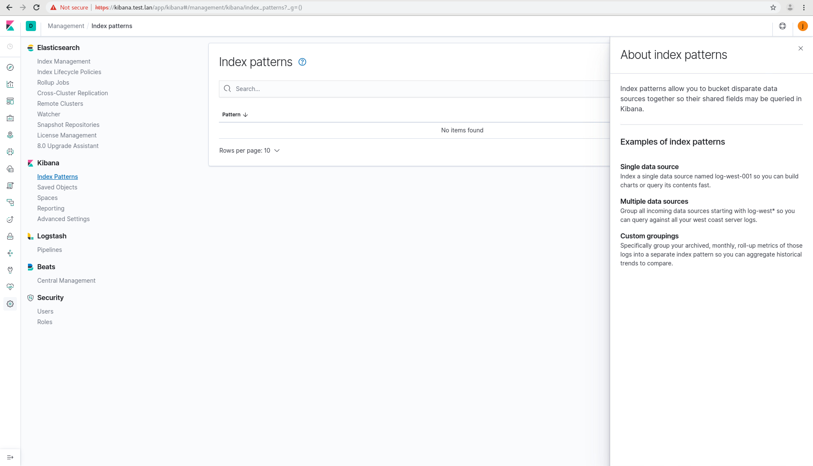
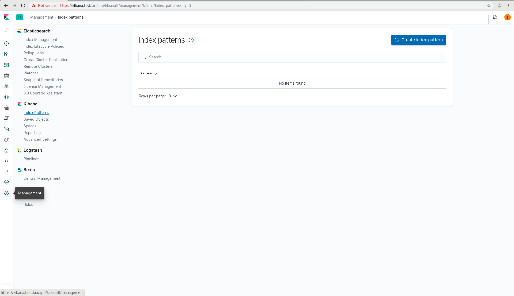
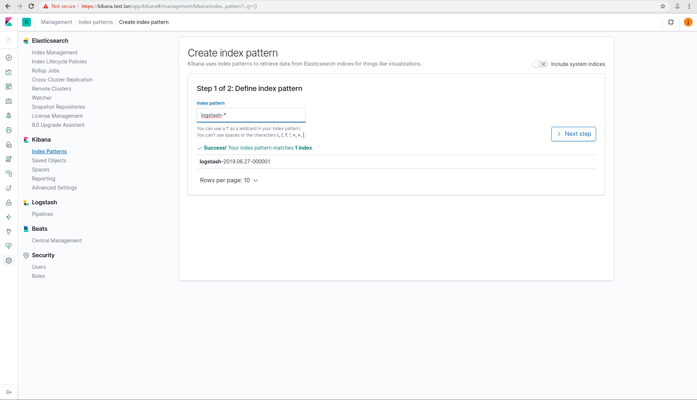
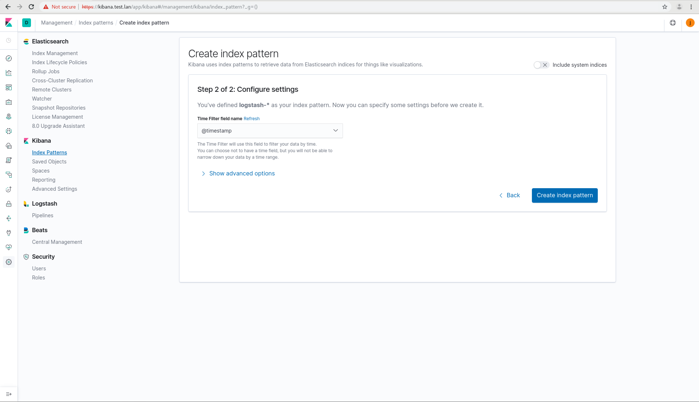

### Elastic Stack Configuration

Navigate to Kibana and login with the account you setup during install.

On the left at the very bottom is a gear icon. This is the Management Icon if you hover over it. Click it.

Under Kibana on the left side, click "Index Management". This is NOT the one under Elasticsearch.

Click the X in the webpage to close the pane titled "About Index Patterns".

Now click the "Create index pattern" button.

In the Index Pattern box, type "logstash-\*" and click Next Step.

Select "@timestamp" from the Time Filter field name and click the "Create index pattern" button.

Congratulations. You're now ready to search your data in Kibana.
