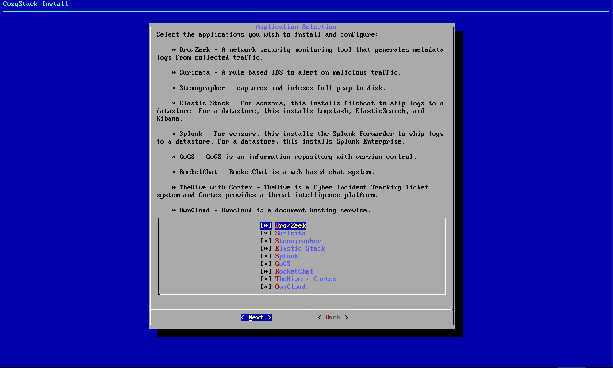

### Install

For security reasons, it is highly encouraged that you enable DISA STIGs for RHEL Servers.

Once you have setup your server(s), you can migrate the tar.gz file onto the server. Then unpack the files and run 'install.sh'. After a few moments, you will be greeted with a welcome screen.

These menus are contextual, so you will only be prompted to configure/install packages you select to install. The first thing you must select is the server role(s). This means what functions the server is intended to perform. Sensors collect and analyze network traffic (think Snort), datastores store the logs into searchable (and analyzable) formats, and Communication servers install tools to collaborate with other people with.

Even if you are not interested in the communication tools, you must have at least 1 communication server setup in your cluster and that server must be setup first. This will install FreeIPA and your entire SSO setup requires FreeIPA.

If you do not want SSO, then modify the scripts to exclude it - but this installer requires you to use it.

In a single server environment, you can choose to install all of the tools on one server. If you would like to exclude any of them, it's also your choice. There is no error checking here to make sure the choices you make actually make sense. So, if you choose to install a datastore but do not install Splunk or Elastic, you will not have any data storage in a SIEM environment.  

On this screen, choose how many Bro workers and Stenographer threads you want. I recommend 4 Bro Workers per 1Gbps of traffic you want to analyze and 1 Stenographer thread (minimum 2 threads).

If you do not see this screen, you chose not to install either Bro/Zeek or Stenographer.

On this screen you can choose to customize what kind of Elastic nodes are being loaded onto your box.
* Master nodes are the main ingest point of the data (and come with Logstash).
* Search Nodes are the node Kibana connects. Kibana will also be installed with a search node.
* Finally, data nodes store the actual data.

In general, you will want to install all of these. You can install some on different servers and let ElasticSearch cluster itself. Obviously, if you have 1 server, you want all 3.

Now, it's time to configure the amount of heap memory and the number of data nodes.

In my experience, I want to assign half of my memory to the heap and half to the stack. So if I have 32Gb of RAM that I want to assign to Elastic - I will divide it in half for the heap. That's 16Gb. Then I will divide that by the number of nodes I have on the box. By default this is the number of data nodes PLUS 2 (master and search node).

So two data nodes + a master node + a search node = 4 total nodes.

If I have 16 Gb to assign to heap, then I want to assign each of the nodes 4Gb of heap.

This means I would set this to 2 Data Nodes and ES Heap Memory to 4

Really, this is about trial and error type experimentation for your environment.

Now, choose the interface that you will use to connect to the server to do administrative functions on.

Choose the interface that will collect the traffic (the promiscuous one)

Configure your Domain and IP Range (first 3 octets only...). This must match the domain entered during the pre-installation script.

Now, configure the individual IP addresses for each application. Each IP must be addressable inside of your network. If they aren't, this will fail. (and you will have to start from scratch, because this configures the Docker container - which you can't reconfigure after the fact.)

You can now create a username and use the password you previously used during pre-install (you still remember it - right?). Do not call your user 'admin', 'cozyadmin', 'localadmin', anything in the linux default user list (like root or adm), or anything that will conflict with a default. If you want admin accounts and user accounts, I recommend "nameadm". Mine would be "jarvisadm" but that's really up to you. (not sure if periods are allowed in FreeIPA)

Finally, confirm your settings are correct before you being. In a virtual environment, it's easy to revert to a snapshot. But on actual hardware, this may mean a complete reinstall if incorrect. (I've never tested running the script twice on the same machine...)

And you are complete. You will now need to configure the individual applications. 
