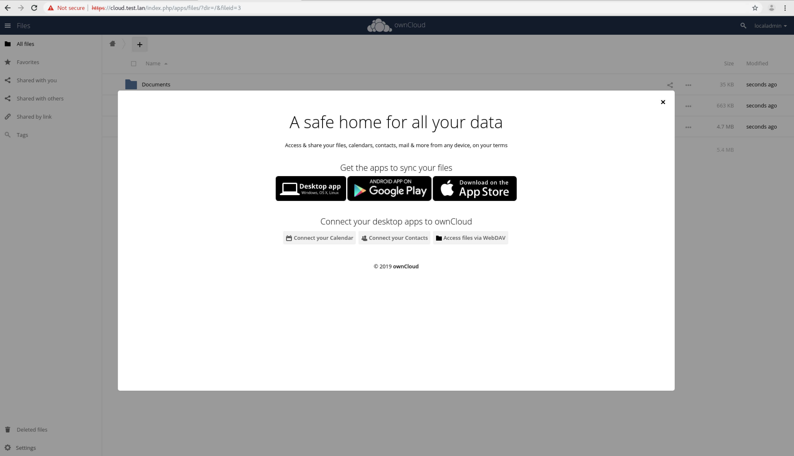
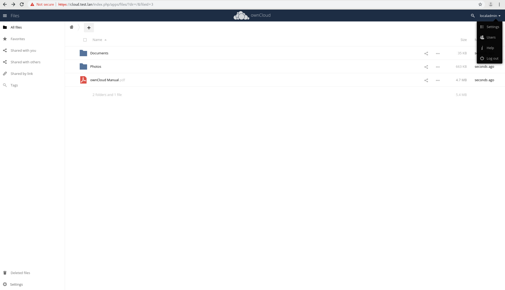
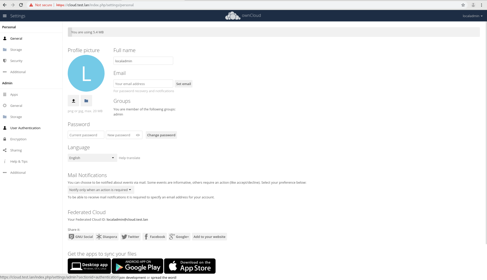
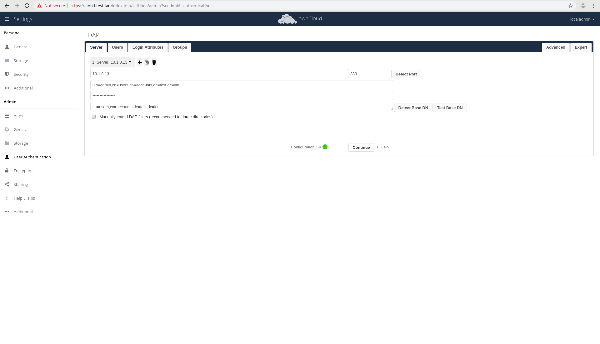
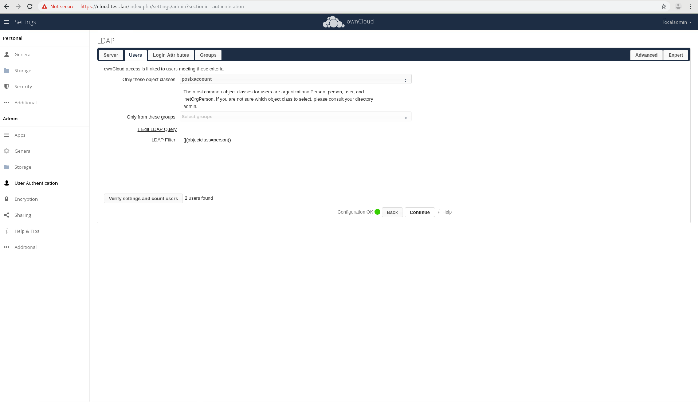
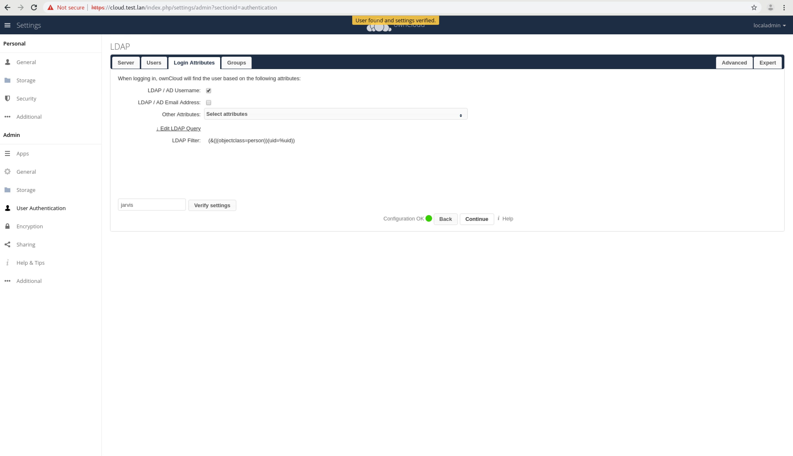

### SSO Setup for OwnCloud.

In order for Single Sign On to work in owncloud, you must install the plugin (which the installer does) and you must login

Navigate to OwnCloud (ex: https://owncloud.test.lan). Log in as 'localadmin' with the password you set during install.

In the top right of the webpage, click the localadmin name. A drop down menu should pop up. Choose 'settings'.

On the left middle, select 'User Authentication'.

While not required, I hit 'Test Base DN' button. If you get a green light, click Continue.

Click the 'Verify settings and count users'. It should say 2 (admin and your user) unless you've created additional users.

Finally, type in your username that you created during install and click 'Verify settings'. The LDAP configuration is now ready to go.

Once you have verified your user, you can log out.
