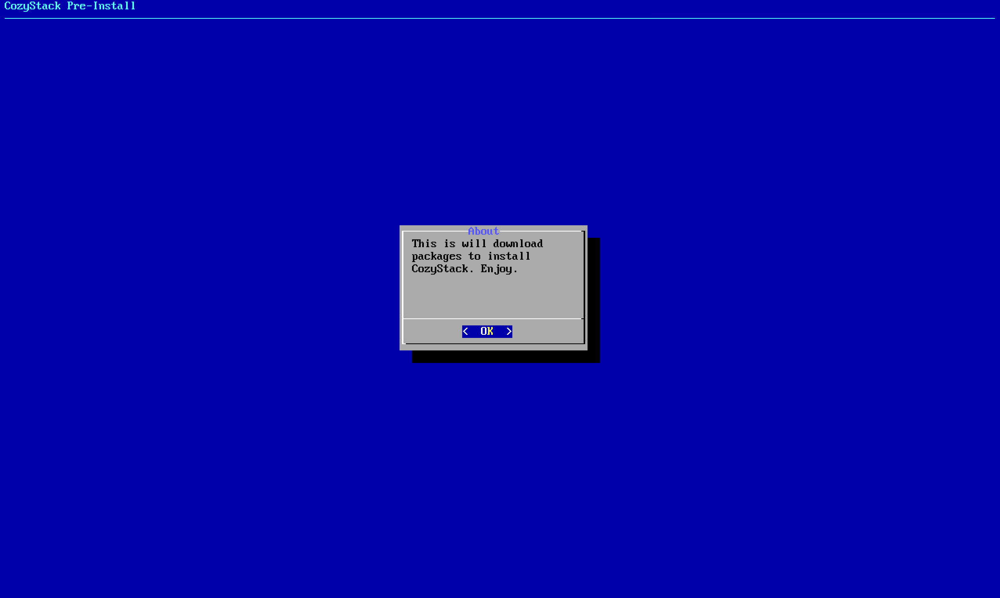
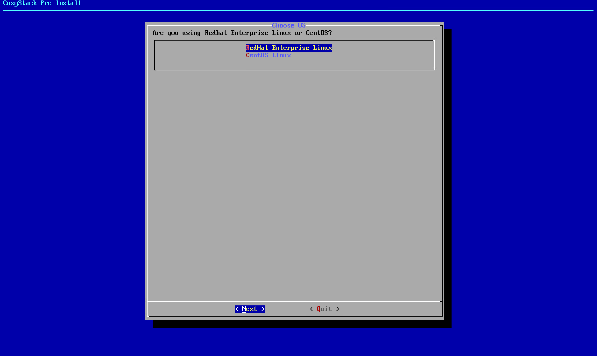
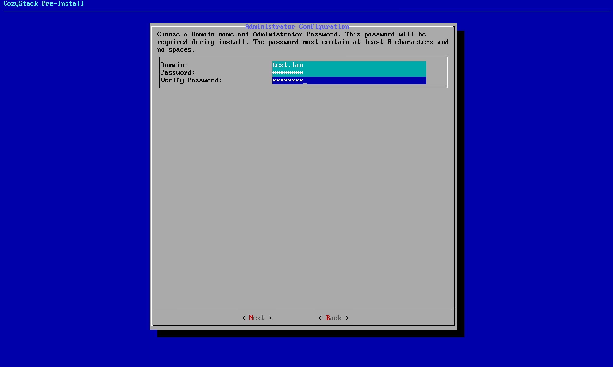
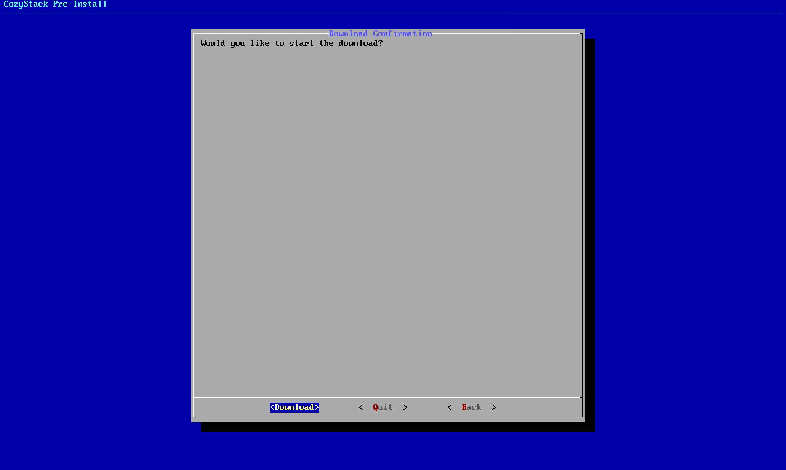
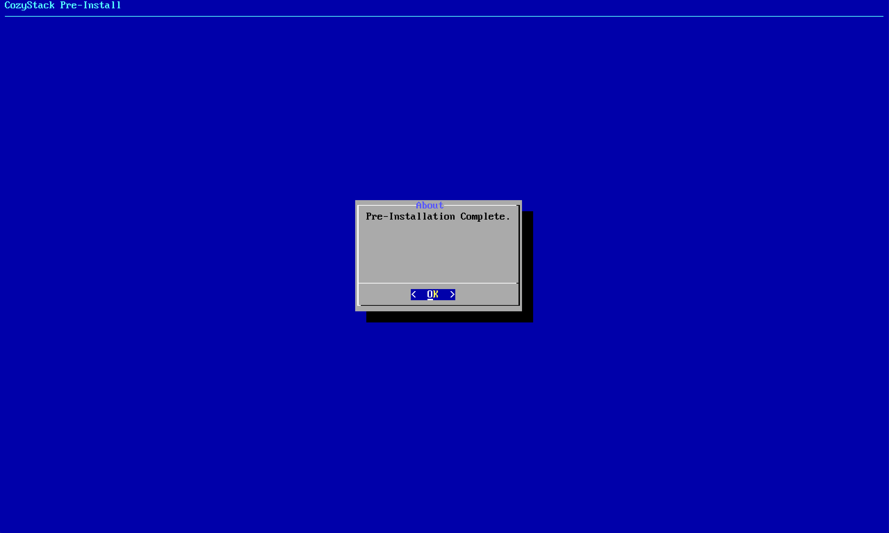

### Pre Install

Setup a (virtual) machine with a minimal RHEL or CentOS install. There must be atleast 20GB for docker images in /var/lib and and 20GB of space in the directory where you are going to run scripts from.

Download and transfer the scripts the machine. If it's a VM, I recommend creating a snapshot here in case something goes wrong.

Now, switch to user root and run 'preinstall.sh'. After a minute, a box will pop up to start the download process.

Select your OS. This must match the OS you are currently using.

Configure your Domain and administrator password. Remember these as you will have to input the same one when you install the full stack.

The password must be at least 8 characters. This is for FreeIPA. 

Finally, choose to download the packages.

After about 30 minutes (depending on internet speeds), you will have a tarball package waiting for you. Transfer this to your server(s) and run the install.

