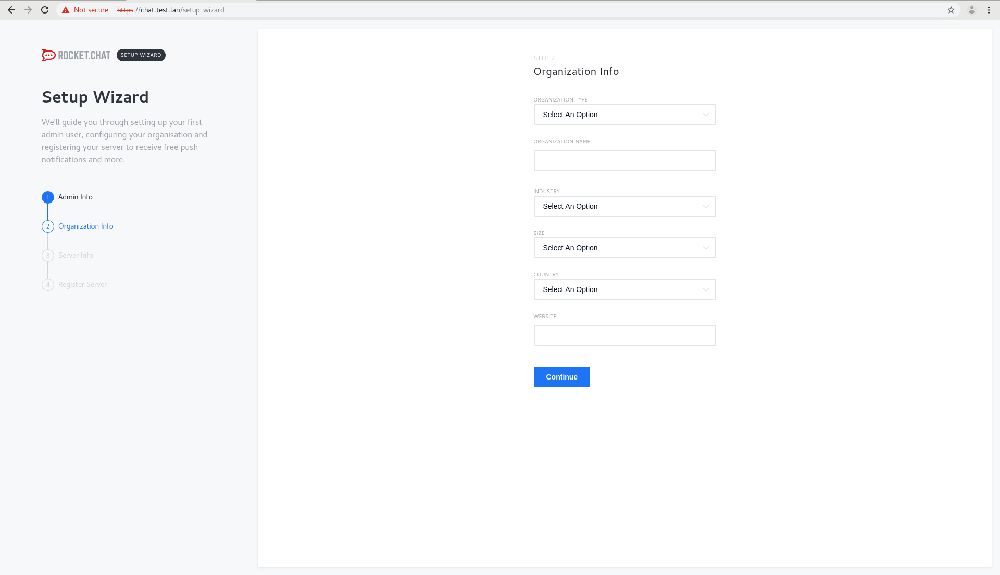
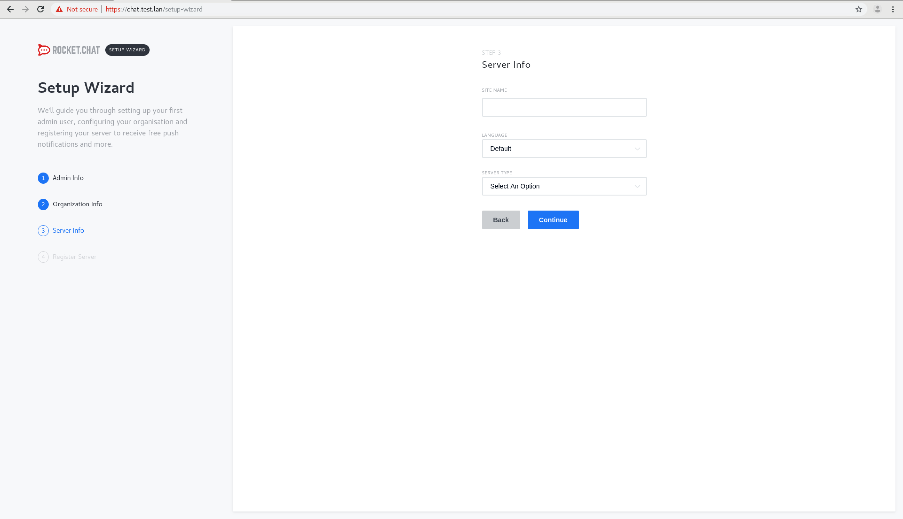
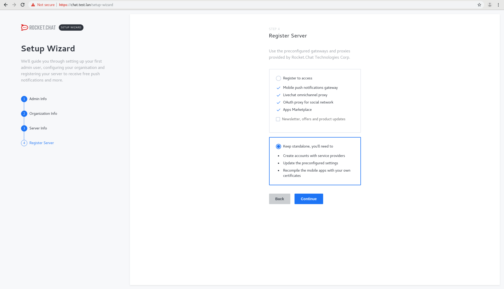
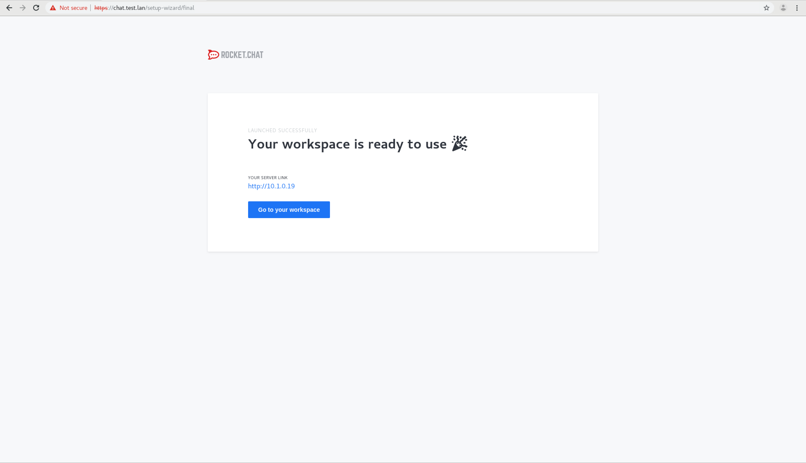
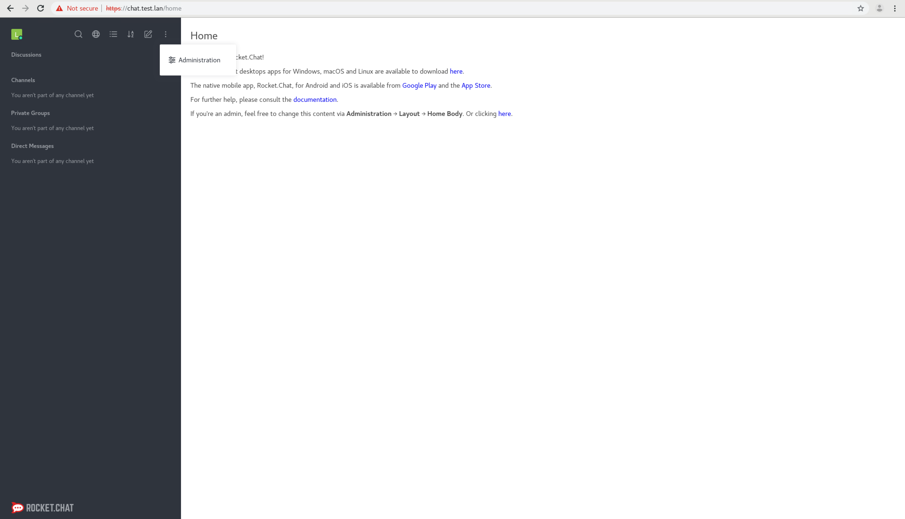
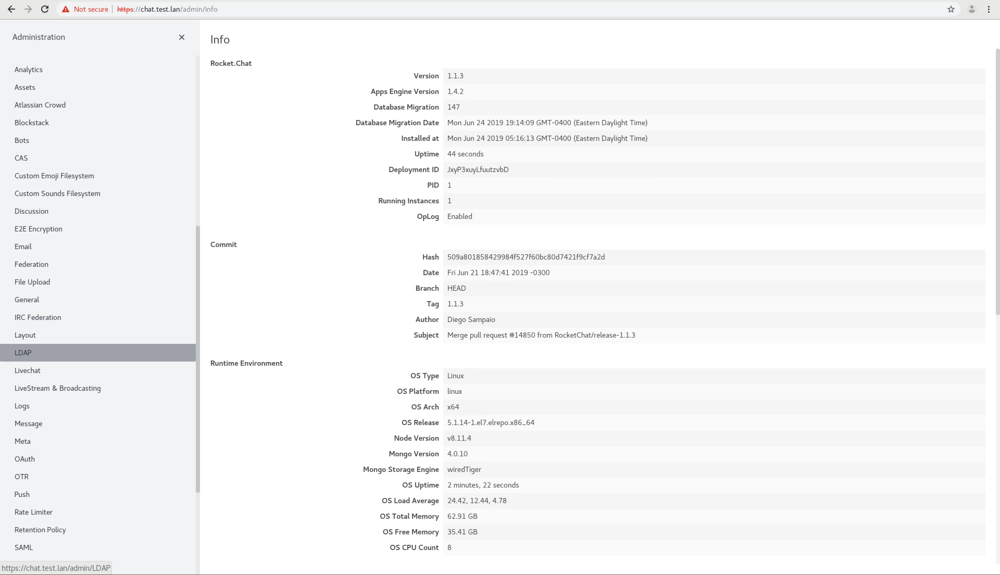
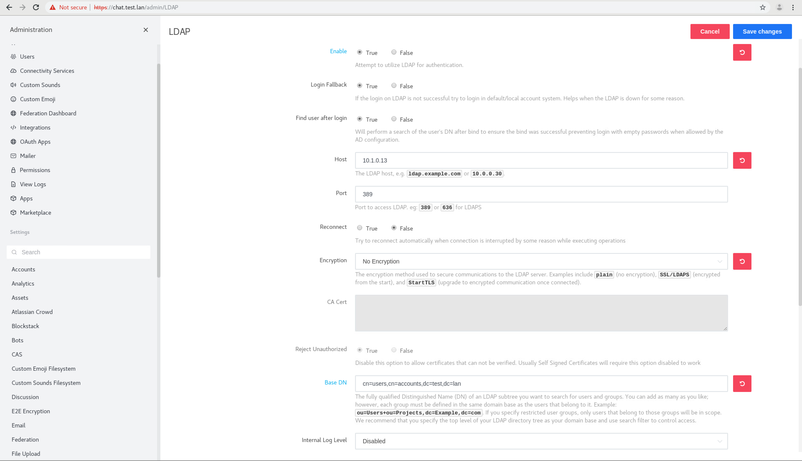
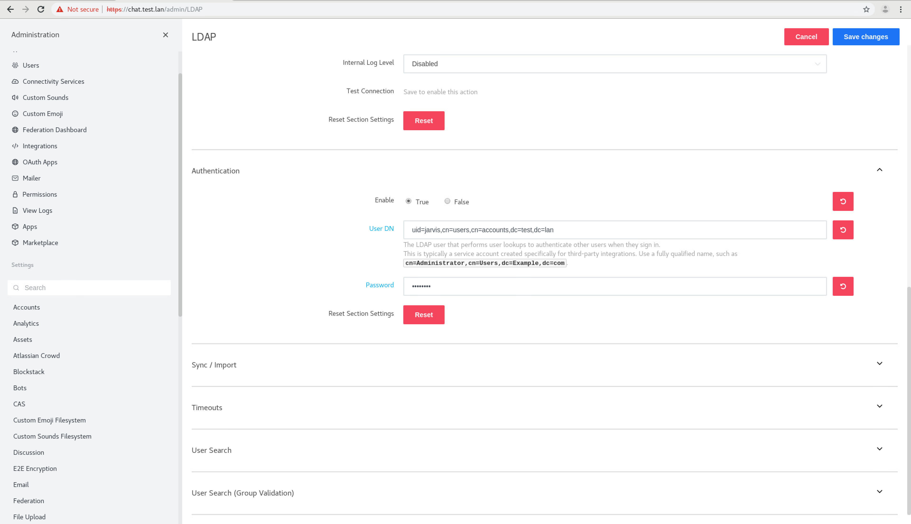
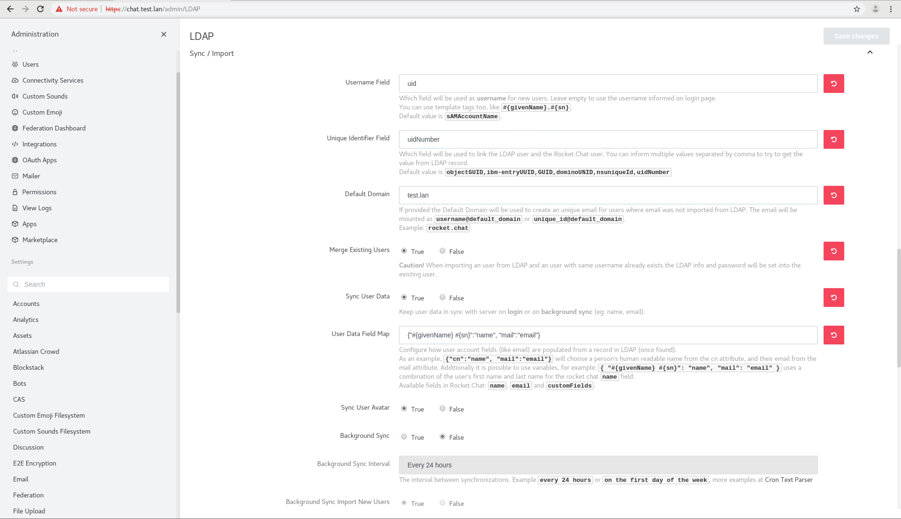
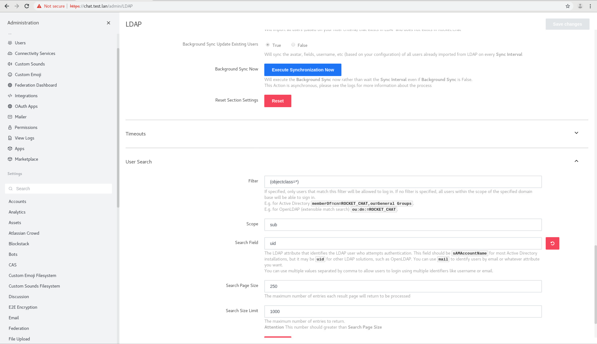

### RocketChat Configuration

Navigate to rocketchat and login as 'localadmin' with the password you entered during install. You will be prompted with a few options. Click 'Continue'.

Click 'Continue', again.

Choose "Keep standalone, you'll need to..." and click "Continue".

Your workspace is now ready to use. Click "Go to your workspace".

On the main screen, Click the 3 dot menu in top left third of the screen. Select "Administration" (it's the only options from the drop down.)

In the menu on the left, find "LDAP" and click on it.

Let's configure LDAP. Some of these settings might already be configured.

* Enable LDAP (true)
* Host: your FreeIPA IP.
* Port: 389
* Base DN: cn=users,cn=accounts,dc=DOMAIN,dc=TLD
Save and click "Test Connection" (the button will appear after you save changes).

If successful, proceed.

Under Authentication:
* User DN: uid=USERNAME,cn=users,cn=accounts,dc=DOMAIN,dc=TLD
* Password: the password you set during install.

Under Sync/Import:
* Username Field: uid
* Unique Identifier Field: uidNumber
* default domain: the domain you set during install (including TLD)
* User Data Field Map: {"#{givenName} #{sn}":"name", "mail":"email"}

Save Changes and Click "Execute Synchronization Now."

Under User Search:
* Search Field: uid

Save Changes. You can hit the 'X' in the top left third of the window to close the administration page. Then log out and try to log in as your IPA account you created during install. 

