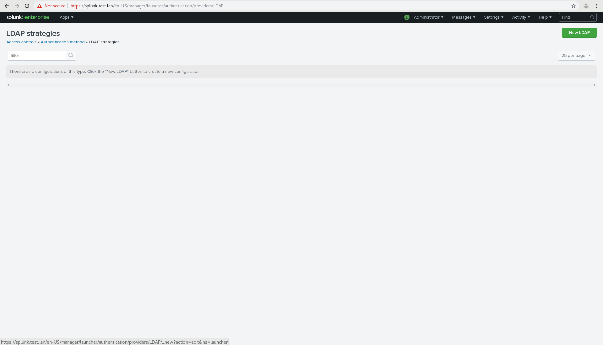

### Splunk Configure

Navigate and log into splunk as 'admin' with the password you entered during install. In the top right, go to settings and then click on "Access Controls"

Next choose "Authentication method"

Under External, select "LDAP" and then click "Configure Splunk to use LDAP."

In the top right, Click the 'New LDAP' button.

The next two images explain how I set up a basic instance.

* LDAP Strategy Name can be anything you want, but it can't be changed later.
* Host should point to your FreeIPA IP.
* Port is 389.
* Connection Order is 1 (first source tried).
* Base DN: uid=USERNAME,cn=users,cn=accounts,dc=DOMAIN,dc=TLD
    - Username: the one you input during the install.
    - DOMAIN: The Domain you input during install (without the TLD)
    - Top Level Domain (TLD): Is like .com, .org, .edu, .lan. If you use something like .co.uk, then it's "dc=co,dc=uk".
* Bind DN Password is the password input during install. Confirm this below.
* User Base DN: cn=users,cn=accounts,dc=DOMAIN,dc=TLD.
    - See "Base DN" (minus the UID)
* Skip User Base filter.
* User name attribute: uid
* Real name attribute: givenName
* Email attribute: mail
* Group mapping attribute: uid
* Group Base DN: cn=groups,cn=compat,dc=DOMAIN,dc=TLD
    - See "Base DN"
* Group name attribute: cn
* Static Member Attribute: memberuid

Go to the end and click "Save"

After the page loads, click "Map groups" on the right.

You'll be given a list of groups. You will need to provide permissions for your groups. Click on the group you want to configure. They need to have at least 1 to log in.

I assign all permissions to admins and only 'user' and 'power' to regular users. You will want to configure based on your needs.

